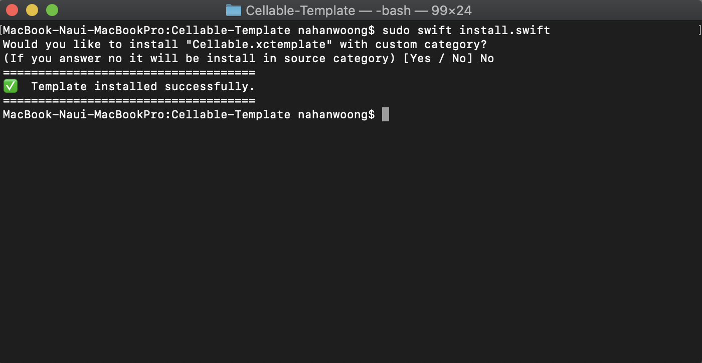

# Cellable Template

[](https://github.com/nibdevn/Cellable-Template/LICENSE)
## Summary

- [Installation](#installation)
- [Usage](#usage)
- [License](#license)

## Installation

### Using script 
Only need execute this command in terminal:
```swift
sudo swift install.swift
```
You should be this output message:



If all it's ok you now could find your template in Xcode.

## Usage
You will be able to see "Cellable-Template" in Xcode.
you can generate xib file and swift file that implemented "Cellable"


## License

These works are available under the MIT license. See the [LICENSE][license] file
for more info.

[license]: LICENSE
